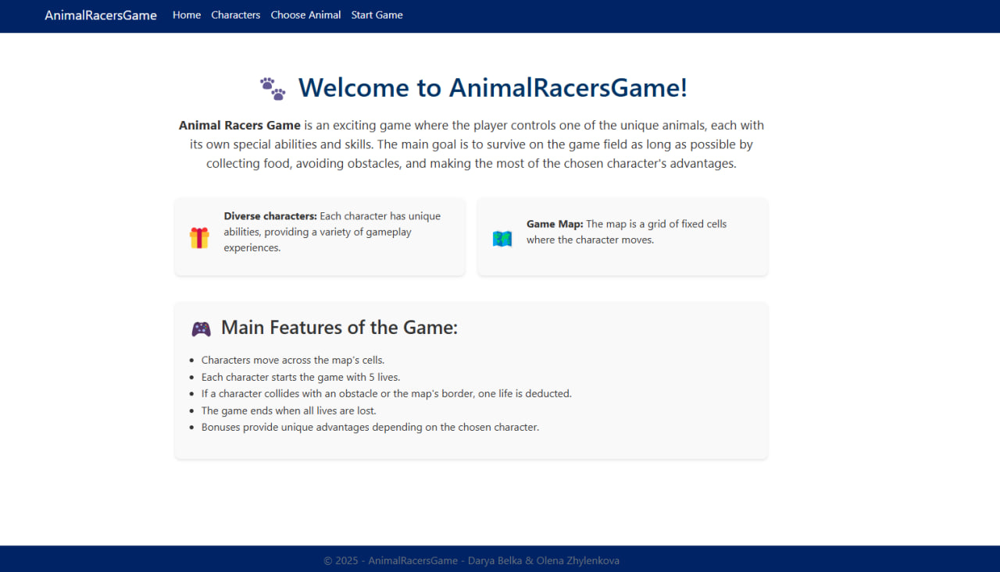
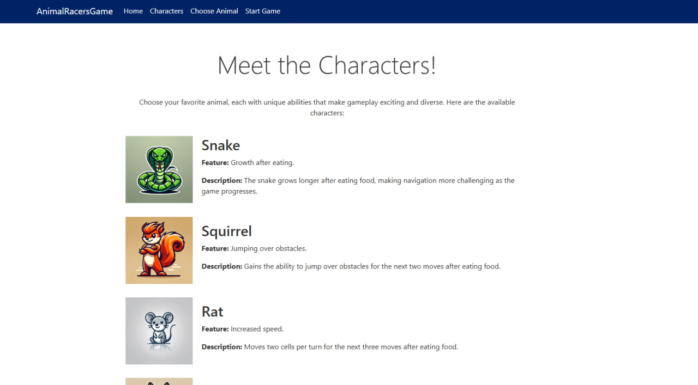
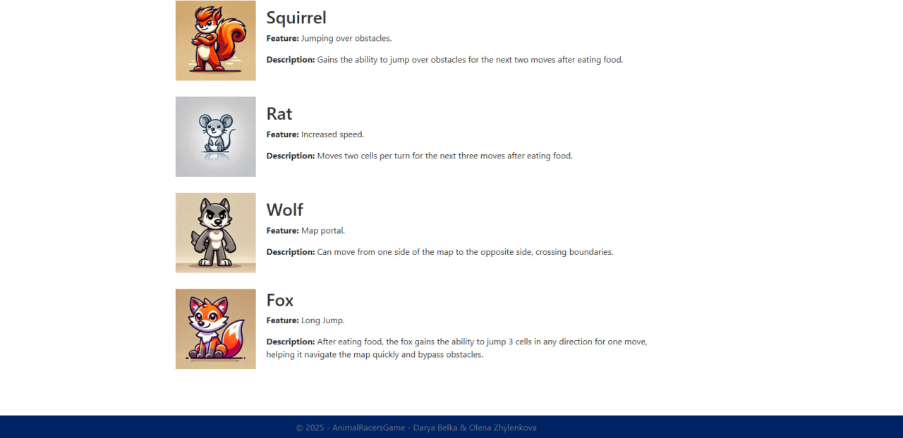
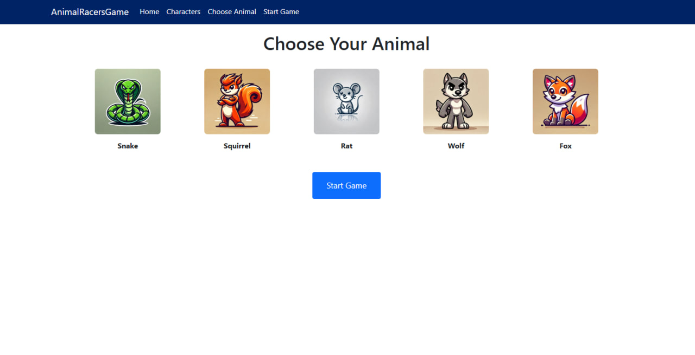
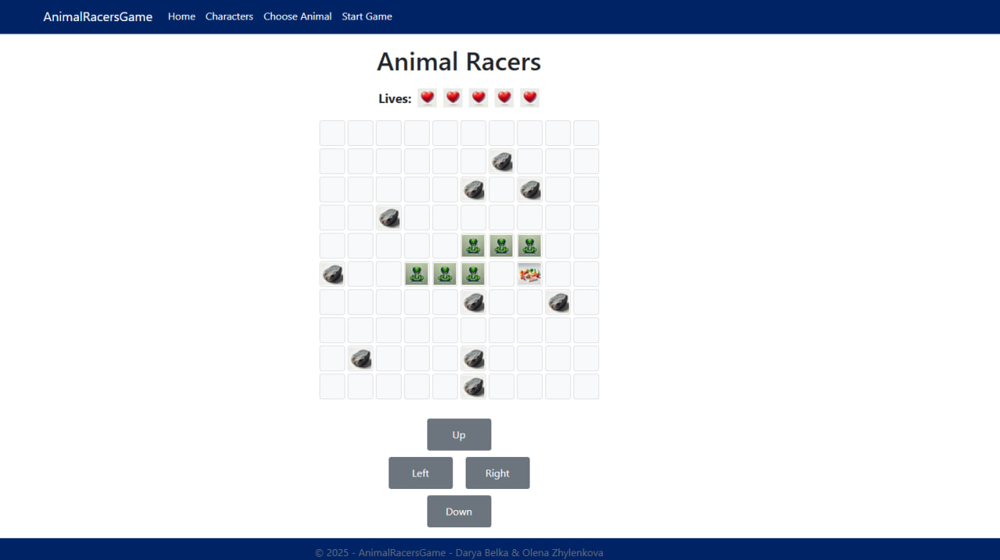

# AnimalRacersGame 🐾

AnimalRacersGame -  is an exciting game where the player controls one of the unique animals, each with its own special abilities and skills. The main goal is to survive on the game field as long as possible by collecting food, avoiding obstacles, and making the most of the chosen character's advantages.

## 🚀 Main Features of the Game:

- Diverse Characters:
  - Snake: Grows longer after eating food, making navigation more challenging as the game progresses.
  - Squirrel: Gains the ability to jump over obstacles for the next two moves after eating food.
  - Rat: Moves two cells per turn for the next three moves after eating food.
  - Wolf: Can teleport across the map's edges, moving from one side to the opposite.
  - Fox: G ains the ability to jump 3 cells in any direction for one move.
 
- Game Mechanics:
  - The map is a grid of fixed cells where the character moves.
  - Each character starts the game with 5 lives.
  - Colliding with an obstacle or the map's border deducts one life.
  - Bonuses provide unique advantages depending on the character.

- Objects on the Map:
  - Food: Activates bonuses.
  - Stones: Restrict movement.

## Game Preview

